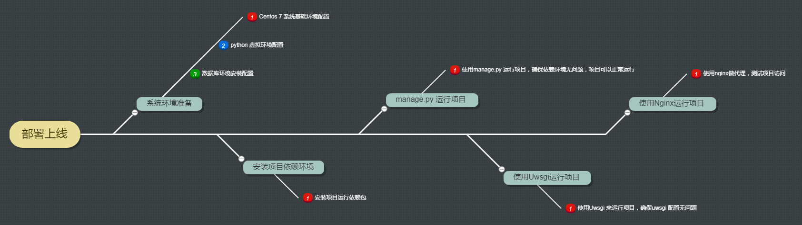
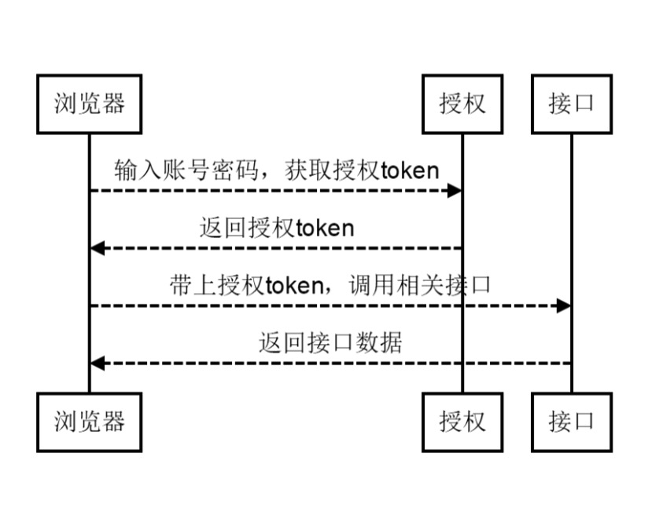

### 项目介绍

- 采用django、django restframework、simpleui框架，开发的一套报名缴费系统。
- 数据库采用mysql
- 

### 项目结构


```
sign_up

├─apps     功能模块
│     ├─  relative           监护人
│     ├─  school             学校
│     ├─  Statistics         统计
│     ├─  students           学生
│     ├─  user_operation     用户操作
│     ├─  user               用户
│     ├─  utils              扩展
│ 
├─db_tool                   数据库脚本
├─extra_apps                第三方包
|    ├─  DjangoUeditor           富文本
|    ├─  rest_framework          第三方框架
|    ├─  simpleui                后台框架
|    ├─  xadmin                  后台框架
│      
├─media                         媒体文件
├─MxShop                        django 配置文件
│     ├─ setting.py              总的配置文件
│     ├─ urls.py                 路由配置
│ 
├─static                        静态文件
├─templates                         模板文件
├─MxShop.conf                        nginx 配置文件
├─requirements.txt                         包文件
├─uwsgi.ini                         uwsgi  配置文件

```


### 具有如下特点

- 动态的权限管理
- 引入Celery定时任务，可动态完成任务的添加、修改、删除、暂停、恢复及日志查看等功能
- 页面交互使用Vue2.x，极大的提高了开发效率
- 引入drf+showdoc文档支持，方便编写API接口文档


### 技术选型

- 核心框架：Django、rest_framework
- 页面交互：Vue2.x+Element
- 负载均衡：nginx
- 中间件：uwsgi
- 测试：petest

### 软件需求

- python 3.6 +
- Django>=2.0
- 内存>2G
- Centos7、windows7+、ubuntu
- mysql 5.5+
- 

### 本地部署



- 要求本地已经安装python 3.6+ 环境
- 进入当前项目文件夹
```
pip install requirements.txt
```
- setting中修改数据库连接用户名、密码

```
DATABASES = {
    'default': {
        'ENGINE': 'django.db.backends.mysql',
        'NAME': '',                 #数据库名字
        'USER': '',                 #账号
        'PASSWORD': '',             #密码
        'HOST': '',                 #IP
        'PORT': '3306',             #端口
        #这里引擎用innodb（默认myisam）
        "OPTIONS":{"init_command":"SET default_storage_engine=INNODB;"}
    }
}
```

- 启动打开本地


```
127.0.0.1:8000
```


- 远程地址


```
```

- 接口测试


```
127.0.0.1:8000
```

- 接口文档


```
127.0.0.1:8000/docs/

https://www.showdoc.cc/page/edit/487575751734503/0
```

### 数据库ER图


### 登录流程



### 前端设计


### 后端设计


